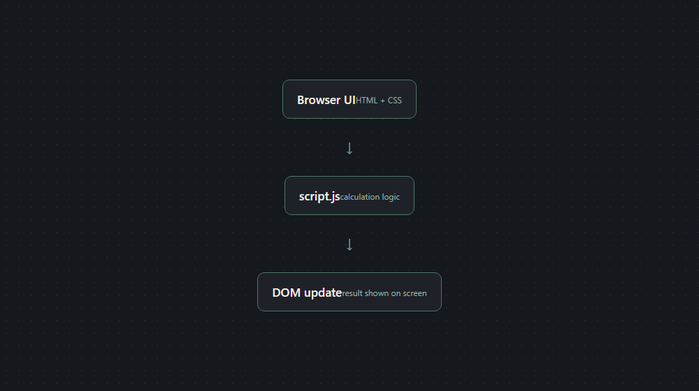

# Architecture

Built a working calculator — digits, the four basic operations, percentage, sign change, decimal
input, backspace, clear — that runs from a single file with nothing to install: open it, use it.
No framework, just HTML, CSS and JavaScript.

It handles digit entry, the four basic operations, percentage, sign change, a running total, and
clears — the same set of buttons you'd expect on a physical desk calculator, no more, no less.
Type a number, pick an operation, type another number, hit equals, and it computes and displays
the result; `AC` resets, `±` flips the sign of whatever's on screen, `%` converts the current value
to a percentage.

**Why vanilla JavaScript, no framework**: a single screen with a dozen buttons and one piece of
state (the current expression) doesn't need a framework's overhead — React or Vue would add a
build step and a bundle for something plain DOM updates handle fine.

## Structure

Everything lives in `index.html`. One file, three parts, in order:

- **Markup**: the calculator's buttons and the display.
- **Styling**: plain CSS, scoped to this page.
- **Logic**: a small set of functions that track the current input, the pending operation and the
  running total, and re-render the display after every button press.

## Language / framework breakdown

| Part | Technology |
|---|---|
| UI | HTML + CSS |
| Behavior | Vanilla JavaScript (no framework) |

## Data and external services

None. There is no database, no API call, and no external dependency of any kind — the whole
thing runs entirely in the browser from a single static file. This template doesn't need a
"local database instead of external" step because there was never anything external to begin
with.

## Running it

Open `index.html` in any browser.
