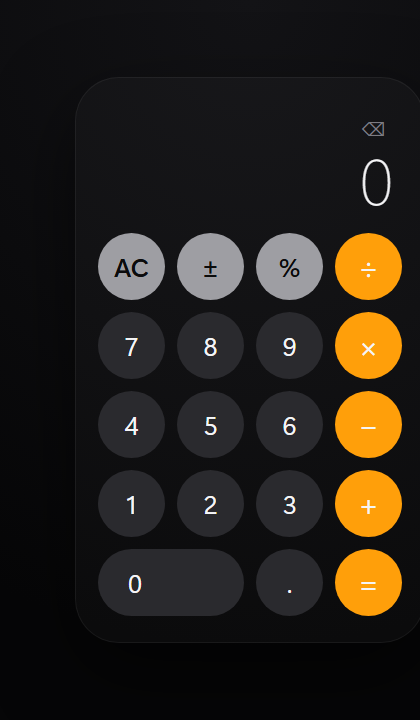

# Calculadora [TEMPLATE]

A single-file calculator built as a self-contained web page.

## Showcase

*Real screenshot, taken by opening `index.html` directly and using it.*

## What's here

- `index.html` — the whole app: markup, styling and logic in one file. No build step, no
  dependencies, no server.

## Running it

Open `index.html` in any browser. That's it.

## Architecture

See [ARCHITECTURE.md](./ARCHITECTURE.md) for how it's structured and what it demonstrates.

## License

MIT — see [LICENSE](./LICENSE).
